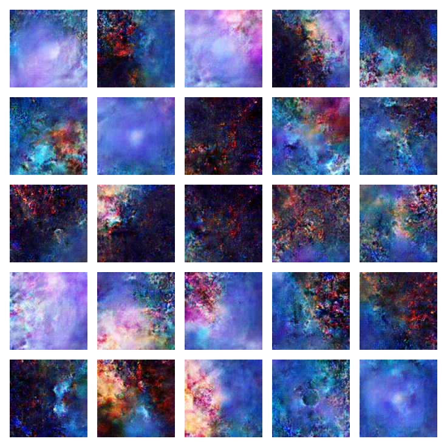

# neuro-GAN
A GAN has been trained with images filtered by special keywords related with neurons and abstract images.  

## Dataset 
The dataset used has been created from images downloaded from the internet using the Bing browser as well as the openverse API. 
You can find the scripts to download the images at [download_images](download_images) folder. 

## Training 

### Trained models
Several GANs have been trained, using different hyperparameters and saving different intermadiate models.

The models have been trained at an AWS AMI:     
Deep Learning Base AMI (Ubuntu 18.04)     
CUDA 11.0 


### Network architecture 

**Model: Discriminator**
```bash
_________________________________________________________________
Layer (type)                 Output Shape              Param #   
=================================================================
conv2d (Conv2D)              (None, 64, 64, 256)       12544     
_________________________________________________________________
leaky_re_lu (LeakyReLU)      (None, 64, 64, 256)       0         
_________________________________________________________________
dropout (Dropout)            (None, 64, 64, 256)       0         
_________________________________________________________________
conv2d_1 (Conv2D)            (None, 32, 32, 512)       2097664   
_________________________________________________________________
leaky_re_lu_1 (LeakyReLU)    (None, 32, 32, 512)       0         
_________________________________________________________________
dropout_1 (Dropout)          (None, 32, 32, 512)       0         
_________________________________________________________________
conv2d_2 (Conv2D)            (None, 16, 16, 1024)      8389632   
_________________________________________________________________
leaky_re_lu_2 (LeakyReLU)    (None, 16, 16, 1024)      0         
_________________________________________________________________
dropout_2 (Dropout)          (None, 16, 16, 1024)      0         
_________________________________________________________________
flatten (Flatten)            (None, 262144)            0         
_________________________________________________________________
dense (Dense)                (None, 1)                 262145    
=================================================================
Total params: 10,761,985
Trainable params: 10,761,985
Non-trainable params: 0
_________________________________________________________________
```

**Model: Generator**

```bash
_________________________________________________________________
Layer (type)                 Output Shape              Param #   
=================================================================
dense_1 (Dense)              (None, 16384)             1638400   
_________________________________________________________________
batch_normalization (BatchNo (None, 16384)             65536     
_________________________________________________________________
leaky_re_lu_3 (LeakyReLU)    (None, 16384)             0         
_________________________________________________________________
reshape (Reshape)            (None, 8, 8, 256)         0         
_________________________________________________________________
leaky_re_lu_4 (LeakyReLU)    (None, 8, 8, 256)         0         
_________________________________________________________________
conv2d_transpose (Conv2DTran (None, 16, 16, 256)       1048576   
_________________________________________________________________
batch_normalization_1 (Batch (None, 16, 16, 256)       1024      
_________________________________________________________________
leaky_re_lu_5 (LeakyReLU)    (None, 16, 16, 256)       0         
_________________________________________________________________
conv2d_transpose_1 (Conv2DTr (None, 32, 32, 128)       524288    
_________________________________________________________________
batch_normalization_2 (Batch (None, 32, 32, 128)       512       
_________________________________________________________________
leaky_re_lu_6 (LeakyReLU)    (None, 32, 32, 128)       0         
_________________________________________________________________
conv2d_transpose_2 (Conv2DTr (None, 64, 64, 64)        131072    
_________________________________________________________________
batch_normalization_3 (Batch (None, 64, 64, 64)        256       
_________________________________________________________________
leaky_re_lu_7 (LeakyReLU)    (None, 64, 64, 64)        0         
_________________________________________________________________
conv2d_transpose_3 (Conv2DTr (None, 128, 128, 3)       3072      
=================================================================
Total params: 3,412,736
Trainable params: 3,379,072
Non-trainable params: 33,664
```

### Code for the GAN
You can find the code at [GAN.py](GAN.py)

### Inspirations 

This code has been inspired on the following open source projects 

[https://keras.io/examples/generative/wgan_gp/](https://keras.io/examples/generative/wgan_gp/) 
[https://github.com/ryanzhang22/Landscape-GAN/blob/master/GAN.py](https://github.com/ryanzhang22/Landscape-GAN/blob/master/GAN.py)

Taking this considerations for good practicies when developing GANs [Ref](https://arxiv.org/pdf/1511.06434v2.pdf)
- Replace any pooling layers with strided convolutions (discriminator) and fractional-strided
convolutions (generator).
- Use batchnorm in both the generator and the discriminator.
- Remove fully connected hidden layers for deeper architectures.
- Use ReLU activation in generator for all layers except for the output, which uses Tanh.
- Use LeakyReLU activation in the discriminator for all layers

## Results 
Intermadiate results are saved to see the evolution for the GANs
at [generated_images](generated_images) folder you can find a mosaic for each saved epoch.     
Every 100 epochs a mosaic has been generated with 25 images generated by the generator at that epoch. 

## Generate random images 
Random noise is generated and is used to generate images with the generated models
[ESRGAN](https://www.tensorflow.org/hub/tutorials/image_enhancing) model is used to resize the image mantaining the resolution. 

The code can be found at [test/generate_random_images.py](test/generate_random_images.py)

## Convert models to tflite
The .h5 files can be converted to tflite as follows: 
```bash
	tflite_convert  --keras_model_file=models/generator1.h5 --output_file=models-tflite/generator1.tflite
```
## Final images 
at the folder images you can find the generated images with the selected models 
